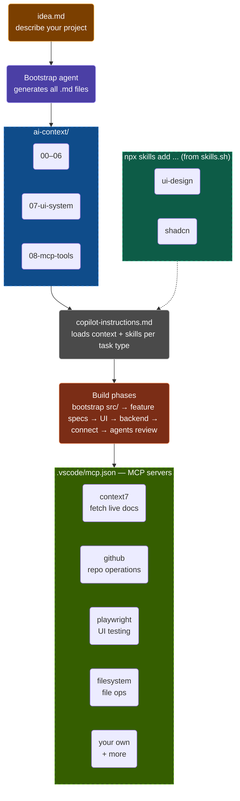

# Vibe-coding Workflow

<p align="left">
  
  &nbsp;
  
  &nbsp;
  
  &nbsp;
  
  &nbsp;
</p>

> One prompt. Agent writes the entire dev system. You review and ship.
 
A project scaffold for AI-native development with GitHub Copilot. Describe your idea — the agent generates all architecture files, feature specs, UI specs, and a progress tracker. You edit, not write from scratch.
 
Works with: **GitHub Copilot** (VSCode) · **Claude Code** · **Cursor** · **Windsurf** · **Antigravity**
 
---
 
## Quick Start
 
**Requires**: Node.js 18+
 
```bash
# 1. Use this repo as a template (recommended)
#    Click "Use this template" on GitHub → create your project repo
 
# or clone directly
git clone https://github.com/dui14/vibe-coding-workflow.git your-project
cd your-project
 
# 2. (Optional) Install skills (skills.sh) for your stack
npx skills add vercel-labs/agent-skills
npx skills add shadcn/ui
etc ...
```
 
> No `npm install` needed. This repo is context files only — no runtime dependencies.
 
---
 
## Run Each Phase
 
| Phase | What to do | Time |
|---|---|---|
| **1. Write idea** | Create `idea.md`, describe your project freely | 5 min |
| **2. Bootstrap** | Paste the bootstrap prompt into Chat | 2 min |
| **3. Review files** | Edit generated `ai-context/` and `spec/` files | 10–20 min |
| **4. Src structure** | Paste the src bootstrap prompt | 1 min |
| **5. Build** | Feature by feature: UI → backend → connect | per feature |
| **6. Review** | Run `agents/reviewer.md` and `agents/ui-qa.md` | per feature |
| **7. Track** | Update `spec/progress.md` | ongoing |
 
Each phase has a copy-paste prompt in the sections below. You never write prompts from scratch.
 
---

## How It Works

You describe your idea. The bootstrap prompt turns it into a complete context system:
all architecture files, feature specs, UI specs, and a progress tracker — written by the agent, not by you.

You review the output, edit what needs changing, then build phase by phase with Copilot (optional).



```
Your idea (1 prompt)
        ↓
Agent writes all context files
        ↓
You review + edit (not write from scratch)
        ↓
Feature specs → UI specs → Build → Review
```

---

## Repository Structure

```
├── .github
│   └── copilot-instructions.md   # Auto-loaded by VSCode Copilot — global rules
├── .vscode
│   └── mcp.json                  # Optional MCP server connections
├── agents
│   ├── reviewer.md               # Code + architecture review agent
│   ├── ui-qa.md                  # UI quality, states, accessibility agent
│   └── security.md               # Security review agent
├── ai-context
│   ├── 00-role.md                # AI persona and behavior rules
│   ├── 01-product.md             # What you're building and for whom
│   ├── 02-tech-stack.md          # Every library and tool with versions
│   ├── 03-architecture.md        # System structure and layer rules
│   ├── 04-database.md            # Schema, models, naming — N/A if no DB
│   ├── 05-api-contract.md        # Endpoints and response shapes — N/A if no API
│   ├── 06-coding-standards.md    # Patterns, naming, anti-patterns
│   └── 07-ui-system.md           # Design tokens, states, component rules
├── spec
│   ├── features/                 # One .md per feature, auto-generated
│   ├── ui/                       # One .md per screen/section, auto-generated
│   └── progress.md               # Build status tracker, auto-generated
├── docs/                         # Auto-generated after each feature
├── AGENT.md                      # Context for Claude Code / agent CLIs
└── CLAUDE.md                     # Context alias for Claude
```

---

## Step 1 — Write Your Idea

Open a new file called `idea.md` in the root. Write freely — no template required.
The more detail the better, but even a short description works.

Example for a SaaS app:
```
I want to build a study schedule manager for university students.
Students can create tasks with deadlines, schedule them into time blocks,
and track their completion progress over time.

Stack: Next.js, Tailwind, Node.js + Express, PostgreSQL, Prisma, JWT auth.
Deploy to Vercel (frontend) + Railway (backend).

Design: clean and minimal, dark mode default, no decorative elements.
```

Example for a personal landing page:
```
Personal portfolio for a frontend developer.
Target: recruiters and potential freelance clients.

Sections: hero with name + title, about, skills, selected projects, contact form.
Skills to show: React, Next.js, TypeScript, Node.js, Tailwind, Figma.

Stack: Next.js + Tailwind, deployed to Vercel. No backend, contact form via Resend.
Design: editorial and typographic, dark background, serif display font, minimal UI.
```

---

## Step 2 — Run the Bootstrap Prompt

Open Copilot Chat in VSCode. Paste this prompt:

```
Read idea.md.

You are a senior software architect. Based on this idea, generate the complete development context system for this project.

Generate and write the following files with full content:

ai-context/00-role.md
— Define the AI role, expertise level, and behavior rules for this project.

ai-context/01-product.md
— Product name, description, target users, core features list, non-goals, and success criteria.

ai-context/02-tech-stack.md
— Every library, framework, and tool with version numbers. Include frontend, backend, database, auth, deployment, and any third-party services.

ai-context/03-architecture.md
— System structure, folder layout inside src/, layer responsibilities, data flow diagram in plain text.

ai-context/04-database.md
— All tables/collections, field names, types, relations, indexes, and naming conventions.
— If this project has no database, write: "N/A — this project has no database layer."

ai-context/05-api-contract.md
— All endpoints: method, path, request body, response shape, error codes.
— If this project has no API, write: "N/A — this project has no API layer."

ai-context/06-coding-standards.md
— Naming conventions, file structure inside src/, patterns to always use, patterns to never use, import order.

ai-context/07-ui-system.md
— Complete design system: color tokens (with hex values), typography scale, spacing scale, breakpoints, animation rules, component state patterns, icon library.

spec/features/
— One .md file per core feature. Each file must include: user story, acceptance criteria, UI states, API endpoints used, validation rules, edge cases.
— If a feature has no UI, note that in the file.

spec/ui/
— One .md file per screen or major section. Each file must include: layout structure, every element and its states (default, loading, error, empty, success), responsive behavior, skeleton structure.
— Only generate this for features that have a UI component.

spec/progress.md
— A status table listing every feature and UI section with status: todo.
— Include a context files checklist.

After generating all files:
1. List every file created
2. Flag any assumptions made due to missing information in idea.md
3. Ask for clarification on flagged items only
```

---

## Step 3 — Review the Generated Files

Go through the generated files. You are editing, not writing.

**Must review:**
- `ai-context/01-product.md` — Check the feature list is complete and correct
- `ai-context/07-ui-system.md` — Adjust colors, fonts, and tone to match your vision
- `spec/features/` — Verify acceptance criteria match what you actually want
- `spec/progress.md` — Confirm the feature list is the right scope

**Quick edits only:**
- `ai-context/02-tech-stack.md` — Swap out any library versions that are wrong
- `ai-context/05-api-contract.md` — Add or rename endpoints if needed

**Usually fine as-is:**
- `ai-context/03-architecture.md`
- `ai-context/06-coding-standards.md`

Files marked `N/A` (like `04-database.md` for a static site) require no action — the agent will skip them automatically during build.

---

## Step 4 — Bootstrap the Source Structure

```
Read all files in ai-context/ in order (00 through 07).

Generate the complete src/ folder structure for this project.
Create placeholder files with correct imports and empty exports.
Follow the architecture in ai-context/03-architecture.md exactly.
Do not implement any logic yet — structure only.
```

---

## Step 5 — Build Feature by Feature

For each feature in `spec/progress.md` with status `todo`:

**5a. Implement UI (section by section):**
```
Read:
- ai-context/02-tech-stack.md
- ai-context/06-coding-standards.md
- ai-context/07-ui-system.md
- spec/ui/[screen-name].md

Implement the [SECTION] section of [SCREEN].
Handle all states: default, loading, error, empty, success.
Mobile-first. Use only design tokens from ai-context/07-ui-system.md.
Do not implement any other section yet.
```

After each section, run:
```
You are the agent defined in agents/ui-qa.md.
Review src/[component-path].
Reference: ai-context/07-ui-system.md
Report findings grouped by: Critical / Warning / Suggestion.
```

**5b. Implement Backend:**
```
Read:
- ai-context/03-architecture.md
- ai-context/04-database.md
- ai-context/05-api-contract.md
- spec/features/[feature-name].md

Implement backend for [FEATURE].
Generate: route → service → repository → validation → error handling.
Response shapes must match ai-context/05-api-contract.md exactly.
```

**5c. Connect Frontend ↔ Backend:**
```
Read ai-context/05-api-contract.md and src/[component-path].
Wire up API calls for [FEATURE].
Handle loading, success, and error states in the component.
Error messages must be user-readable.
```

---

## Step 6 — Agent Reviews

Run after every completed feature:

```
You are the agent defined in agents/reviewer.md.
Review the implementation in src/[path].
Cross-reference: ai-context/03-architecture.md and ai-context/06-coding-standards.md.
```

Run before shipping any auth or data-handling feature:
```
You are the agent defined in agents/security.md.
Review src/[path].
Focus: input validation, auth checks, data exposure, injection risks.
```

---

## Step 7 — Update Progress

```
Update spec/progress.md.
Mark [FEATURE] as done.
Add any notes or follow-up items.
```

---

## Complete Workflow

```
Write idea.md
      ↓
Bootstrap prompt → agent writes all .md files
      ↓
Review + edit generated files (not write from scratch)
      ↓
Bootstrap src/ structure
      ↓
For each feature:
  UI section → ui-qa review → next section
  Backend → reviewer review
  Connect frontend ↔ backend
      ↓
Security review (auth/data features)
      ↓
Update spec/progress.md
      ↓
Next feature
```

---

## N/A Bypass

Files that do not apply to your project are automatically written as `N/A` by the bootstrap agent.

The `copilot-instructions.md` tells Copilot to skip those files silently during build. You never need to delete them or modify them.

Examples of N/A files:
- Static site → `04-database.md` and `05-api-contract.md` are N/A
- No auth → security agent skips auth sections automatically
- API-only project → `07-ui-system.md` is N/A

---

## Getting Started

1. Clone or fork this repo into your project folder
2. Open the folder in VSCode
3. Create `idea.md` and describe your project
4. Open Copilot Chat and paste the Step 2 bootstrap prompt
5. Review the generated files
6. Follow steps 4–7 to build

---

## Adding Skills (skills.sh)

Skills are reusable procedural knowledge files. Install them once, and Copilot reads the relevant skill before each matching task automatically.

```bash
# Install skills for your stack — run from project root
npx skills add vercel-labs/agent-skills        # React + Vercel best practices
npx skills add shadcn/ui                        # shadcn/ui component patterns
npx skills add vercel-labs/next-skills         # Next.js best practices
npx skills add leonxlnx/taste-skill           # High-end visual design
npx skills add better-auth/skills             # Auth patterns
npx skills add supabase/agent-skills          # Supabase + Postgres
npx skills add mattpocock/skills              # Debugging + architecture
npx skills add pbakaus/impeccable             # UI polish and audit
```

Browse all skills: https://www.skills.sh

Skills are placed in `skills/`. See `skills/README.md` for the full list of task-to-skill mappings.

---

## Configuring MCP Servers

`.vscode/mcp.json` is pre-configured with multiple MCP servers. Most are zero-config and work immediately after installation.

---

### Core MCP Servers

**context7** — auto-fetches live docs for any library before Copilot writes library-specific code. This eliminates the most common class of vibe coding bugs (wrong API shapes, deprecated patterns, version mismatches).

**playwright** — browser automation for screenshots, user-flow testing, responsive testing, and UI verification. Run `npm run dev`, then ask Copilot to test flows or capture screenshots.

**github** — repository intelligence and GitHub workflow automation. Can search code, create issues, open PRs, review commits, and inspect repositories directly from the agent.

**filesystem** — high-speed workspace read/write access. Useful for bootstrap generation, scanning codebases, and batch file operations.

---

### Advanced MCP Servers

**chrome-devtools** — deep browser debugging through Chrome DevTools Protocol. Lets the agent inspect console logs, network requests, performance traces, DOM state, and runtime issues directly from the browser.

Use it when:
- Debugging frontend runtime errors
- Investigating hydration mismatches
- Inspecting failed API/network calls
- Profiling performance bottlenecks
- Monitoring memory leaks or render loops

---

**markitdown** — converts documents into clean markdown for AI processing. Supports PDF, DOCX, PPTX, HTML, CSV, and more.

Useful for:
- RAG ingestion
- Converting specs/docs into markdown
- Processing exported reports
- AI-readable documentation pipelines

STDIO mode:
```bash
markitdown-mcp
```

---

## License

This project scaffold is open source and available under the MIT License.

---

## Contributing

Contributions are welcome. Please open an issue or PR to suggest improvements to the workflow or documentation.

---

## Support

For questions or issues:
- Check the README and each `.md` file thoroughly
- Open a [GitHub Issue](https://github.com/dui14/vibe-coding-workflow/issues)
- Read the full documentation in each `ai-context/` file
